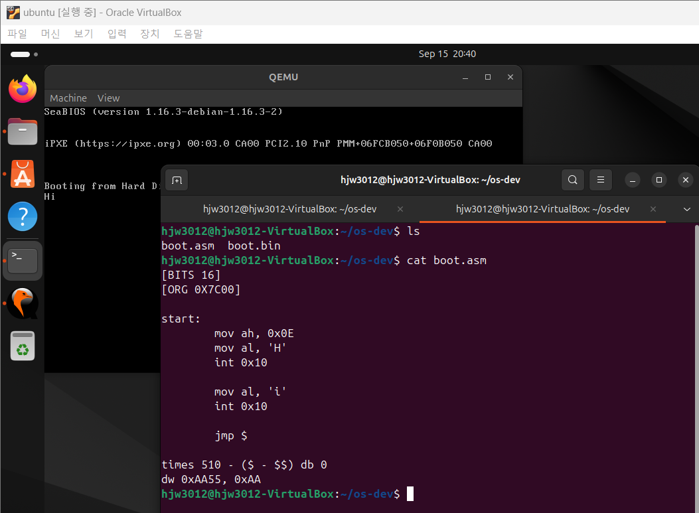

## 코드 설명

```
[BITS 16]
ORG 0x7C00

start:
    mov ah, 0x0E
    mov al, 'H'
    int 0x10

    mov al, 'i'
    int 0x10

    jmp $
times 510 - ($ - $$) db 0
dw 0xAA55, 0xAA

```




- **[BITS 16]**: CPU가 부팅 시 16비트 모드로 동작하기 때문에 16비트 코드임을 명시.
    > BIOS는 부팅 초기에 CPU를 16비트 모드로 설정하지만, 이후 운영체제는 필요에 따라 32비트 또는 64비트 모드로 전환할 수 있다.
- **ORG 0x7C00**: 부트 섹터는 BIOS에 의해 메모리 주소 0x7C00에 로드됨.
- **mov ah, mov al**: 레지스터에 값을 할당하는 명령어로, BIOS 인터럽트를 이용해 화면에 문자를 출력하기 위한 값 설정.
- **int 0x10**: **디스플레이(화면)**와 관련된 BIOS 인터럽트다. BIOS 인터럽트를 호출해서 화면에 문자를 출력.
- **jmp $**: 무한 루프로 빠져들어, 프로그램이 끝난 후 다른 동작을 막음.
- **times ... db 0**: 부트 섹터 크기를 512바이트로 맞추기 위해 빈 공간을 0으로 채움.
- **dw 0xAA55**: 부트 시그니처로, BIOS가 부팅 가능한 코드임을 인식하도록 함.